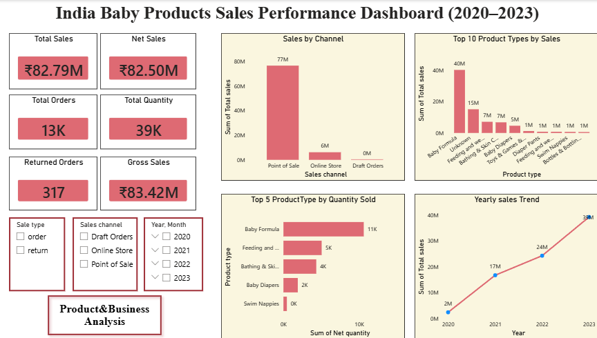
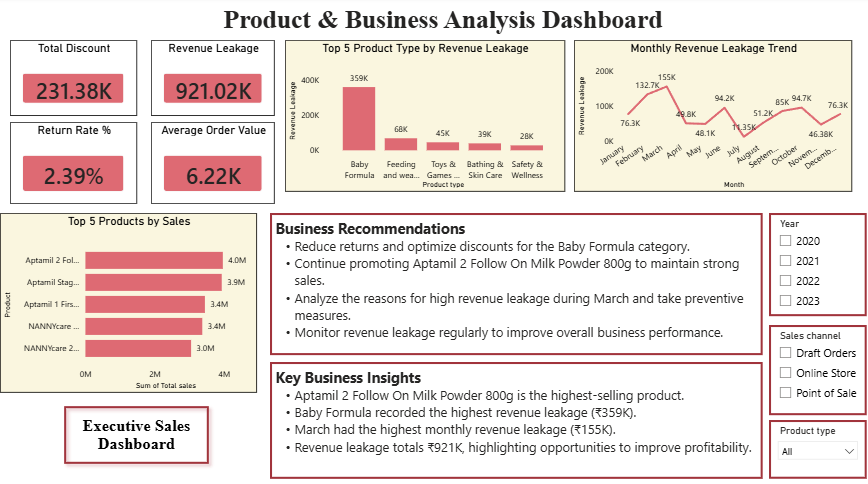

# Indian Baby Products Sales Analysis (2020–2023)

## 📊 Project Overview

Analyzed baby product sales data in India from 2020 to 2023 using Microsoft Excel and Power BI to identify sales trends, product performance, and changes over time.

## 🛠️ Tools Used

- Microsoft Excel
- Power BI
- Power Query

## 📈 Analysis Performed

- Analyzed sales trends from 2020 to 2023
- Compared product performance
- Identified changes in sales over time
- Created interactive Power BI dashboards
- Prepared visual reports to communicate key insights

## 📊 Dashboard Preview

Dashboard screenshots will be added here.

## 🎯 Objective

To analyze Indian baby product sales data and generate meaningful business insights through data visualization and reporting.

## 📌 Outcome

The analysis transformed sales data into interactive dashboards that helped identify sales trends and product performance.

## 📊 Dashboard Preview

### Executive Overview Dashboard

### Product & Business Analysis Dashboard

